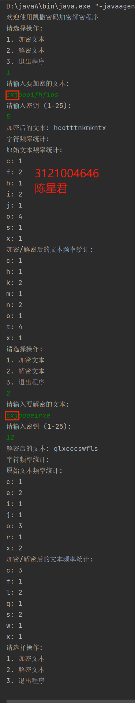

# 一、设计要求
1. 编写凯撒密码Java算法，可以对任意的英文文件进行加密和解密，可以选择密钥。  
2. 显示加密前明文数据和加密后密文数据的字符出现频率统计。  
3. 具有较友好的用户界面。

# 二、开发环境
编程环境：IntelliJ IDEA Community Edition 2023.1.2  
操作系统：Win10

# 三、实验原理

# 四、项目开发
JAVA
```java
import java.io.*;
import java.util.*;

public class CaesarCipher {
public static void main(String[] args) {
Scanner scanner = new Scanner(System.in);
System.out.println("欢迎使用凯撒密码加密解密程序");

while (true) {
System.out.println("请选择操作:");
System.out.println("1. 加密文本");
System.out.println("2. 解密文本");
System.out.println("3. 退出程序");
int choice = scanner.nextInt();
scanner.nextLine(); // 消耗换行符

switch (choice) {
case 1:
System.out.println("请输入要加密的文本:");
String plainText = scanner.nextLine();
System.out.println("请输入密钥 (1-25):");
int key = scanner.nextInt();
scanner.nextLine(); // 消耗换行符

String encryptedText = encrypt(plainText, key);
System.out.println("加密后的文本: " + encryptedText);
displayFrequencyStatistics(plainText, encryptedText);
break;

case 2:
System.out.println("请输入要解密的文本:");
String cipherText = scanner.nextLine();
System.out.println("请输入密钥 (1-25):");
key = scanner.nextInt();
scanner.nextLine(); // 消耗换行符

String decryptedText = decrypt(cipherText, key);
System.out.println("解密后的文本: " + decryptedText);
displayFrequencyStatistics(cipherText, decryptedText);
break;

case 3:
System.out.println("感谢使用，再见!");
System.exit(0);
break;

default:
System.out.println("无效的选择，请重新输入.");
break;
}
}
}

public static String encrypt(String text, int key) {
StringBuilder encryptedText = new StringBuilder();
for (char c : text.toCharArray()) {
if (Character.isLetter(c)) {
char base = Character.isLowerCase(c) ? 'a' : 'A';
int offset = c - base;
char encryptedChar = (char) (((offset + key) % 26) + base);
encryptedText.append(encryptedChar);
} else {
encryptedText.append(c);
}
}
return encryptedText.toString();
}

public static String decrypt(String text, int key) {
return encrypt(text, 26 - key);
}

public static void displayFrequencyStatistics(String originalText, String modifiedText) {
Map<Character, Integer> originalFrequency = calculateFrequency(originalText);
Map<Character, Integer> modifiedFrequency = calculateFrequency(modifiedText);

System.out.println("字符频率统计:");
System.out.println("原始文本频率统计:");
displayFrequency(originalFrequency);

System.out.println("加密/解密后的文本频率统计:");
displayFrequency(modifiedFrequency);
}

public static Map<Character, Integer> calculateFrequency(String text) {
Map<Character, Integer> frequencyMap = new TreeMap<>();
for (char c : text.toCharArray()) {
if (Character.isLetter(c)) {
frequencyMap.put(c, frequencyMap.getOrDefault(c, 0) + 1);
}
}
return frequencyMap;
}

public static void displayFrequency(Map<Character, Integer> frequencyMap) {
for (Map.Entry<Character, Integer> entry : frequencyMap.entrySet()) {
System.out.println(entry.getKey() + ": " + entry.getValue());
}
}
}

```
# 五、结果测试

# 六、总结
凯撒算法是一种经典的简单替换加密技术，通过对明文中的每个字母按照一个固定数目的偏移量进行替换来实现加密。在实验中，我们首先明确了凯撒算法的基本原理，即对字母表中的每个字母进行固定偏移量的移动。然后，我们设计了一个简单的加密函数来实现凯撒算法的加密过程，并且确保了其能够处理各种情况下的输入，包括大写字母、小写字母以及非字母字符。在实验过程中，我们发现凯撒算法虽然易于理解和实现，但是其安全性较差。由于其简单的字母替换方式，容易受到频率分析等常见攻击方法的影响，导致被轻易破解。因此，我们意识到在真实的应用场景中，凯撒算法并不适合处理敏感信息的加密需求。另外，在实验中我们还深入探讨了凯撒算法的加密强度和易用性之间的权衡。虽然其易于实现和理解，但其加密强度有限。我们强调了在实际使用中，应该考虑更加复杂的加密算法，例如AES、RSA等，以确保数据的安全性和机密性。总的来说，这次凯撒算法实验帮助我们更好地理解了经典加密算法的工作原理和特点。我们明白了凯撒算法的局限性，并认识到在实际应用中需要更加安全和复杂的加密技术来保障数据的安全。