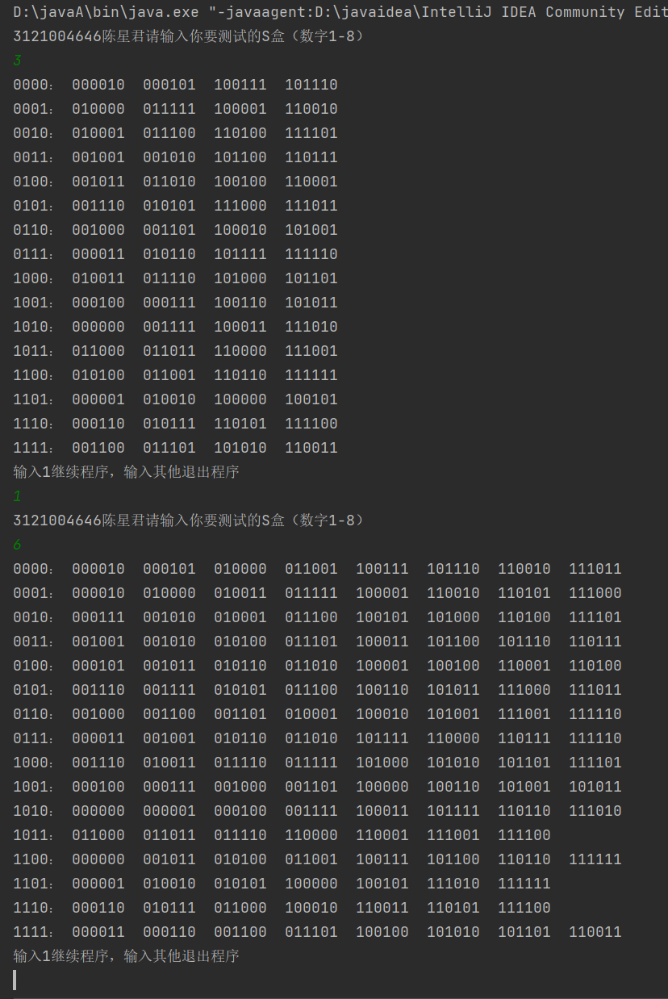
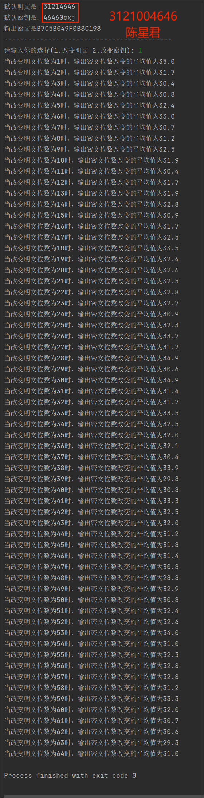
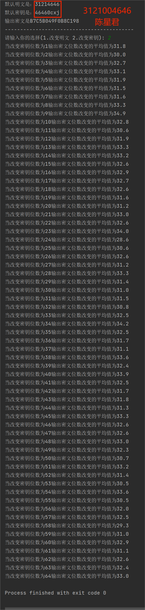

# 一、设计要求
1. 给定某个Sbox的输入差分情况下，计算所有输入对和所有Sbox输出差分的分布情况。
2. 统计DES算法在密钥固定情况，输入明文改变1位、2位......64位时。输出密文位数改变情况。
3. 统计DES算法在明文固定情况，输入密钥改变1位、2位......64位时。输出密文位数改变情况。  
（注意：为了具有客观性，2，3小题需要对多次进行统计，并计算其平均值。）

# 二、开发环境
编程环境：IntelliJ IDEA Community Edition 2023.1.2  
操作系统：Win10

# 三、实验原理
- 初始置换（Initial Permutation）：
明文被划分为 64 比特的块，经过初始置换产生新的排列，用于后续处理。

- 密钥生成：
使用 56 比特的密钥作为输入，通过置换和轮密钥生成算法产生 16 个 48 比特的子密钥，每个子密钥用于每一轮的加密。

- 轮函数（Round Function）：
DES 使用 Feistel 结构。每轮包括将 64 比特的数据分为左右两部分，并应用轮函数对右半部分进行处理。
右半部分经过扩展置换、与子密钥的异或运算、S 盒代替、P 盒置换等步骤，产生新的右半部分。

- 轮密钥加（Round Key Addition）：
每轮将生成的子密钥与右半部分的输出进行异或操作。

- 16 轮迭代：
DES 算法执行 16 轮迭代（每轮使用一个子密钥）。

- 逆置换（Final Permutation）：
经过 16 轮迭代后，左右两部分交换，并进行最终的逆置换。
# 四、项目开发
1. 给定某个Sbox的输入差分情况下，计算所有输入对和所有Sbox输出差分的分布情况
JAVA
```java
import java.nio.channels.ScatteringByteChannel;
import java.util.Scanner;

public class Sbox {

    //二进制转化为10进制
    public static int binaryToDecimal(String str){
        int len  = str.length();
        int res=0;
        for (int i = 0; i < len; i++) {
            res+=Integer.parseInt(String.valueOf(str.charAt(len-i-1)))*Math.pow(2,i);
        }
        return res;
    }
    // S盒，每个S盒Si是4x16的置换表，6位 -> 4位
    final static int[][][] S_BOX ={
            {
                    {14,4,13,1,2,15,11,8,3,10,6,12,5,9,0,7},
                    {0,15,7,4,14,2,13,1,10,6,12,11,9,5,3,8},
                    {4,1,14,8,13,6,2,11,15,12,9,7,3,10,5,0},
                    {15,12,8,2,4,9,1,7,5,11,3,14,10,0,6,13}
            },
            {
                    {15,1,8,14,6,11,3,4,9,7,2,13,12,0,5,10},
                    {3,13,4,7,15,2,8,14,12,0,1,10,6,9,11,5},
                    {0,14,7,11,10,4,13,1,5,8,12,6,9,3,2,15},
                    {13,8,10,1,3,15,4,2,11,6,7,12,0,5,14,9}
            },
            {
                    {10,0,9,14,6,3,15,5,1,13,12,7,11,4,2,8},
                    {13,7,0,9,3,4,6,10,2,8,5,14,12,11,15,1},
                    {13,6,4,9,8,15,3,0,11,1,2,12,5,10,14,7},
                    {1,10,13,0,6,9,8,7,4,15,14,3,11,5,2,12}
            },
            {
                    {7,13,14,3,0,6,9,10,1,2,8,5,11,12,4,15},
                    {13,8,11,5,6,15,0,3,4,7,2,12,1,10,14,9},
                    {10,6,9,0,12,11,7,13,15,1,3,14,5,2,8,4},
                    {3,15,0,6,10,1,13,8,9,4,5,11,12,7,2,14}
            },
            {
                    {2,12,4,1,7,10,11,6,8,5,3,15,13,0,14,9},
                    {14,11,2,12,4,7,13,1,5,0,15,10,3,9,8,6},
                    {4,2,1,11,10,13,7,8,15,9,12,5,6,3,0,14},
                    {11,8,12,7,1,14,2,13,6,15,0,9,10,4,5,3}
            },
            {
                    {12,1,10,15,9,2,6,8,0,13,3,4,14,7,5,11},
                    {10,15,4,2,7,12,9,5,6,1,13,14,0,11,3,8},
                    {9,14,15,5,2,8,12,3,7,0,4,10,1,13,11,6},
                    {4,3,2,12,9,5,15,10,11,14,1,7,6,0,8,13}
            },
            {
                    {4,11,2,14,15,0,8,13,3,12,9,7,5,10,6,1},
                    {13,0,11,7,4,9,1,10,14,3,5,12,2,15,8,6},
                    {1,4,11,13,12,3,7,14,10,15,6,8,0,5,9,2},
                    {6,11,13,8,1,4,10,7,9,5,0,15,14,2,3,12}
            },
            {
                    {13,2,8,4,6,15,11,1,10,9,3,14,5,0,12,7},
                    {1,15,13,8,10,3,7,4,12,5,6,11,0,14,9,2},
                    {7,11,4,1,9,12,14,2,0,6,10,13,15,3,5,8},
                    {2,1,14,7,4,10,8,13,15,12,9,0,3,5,6,11}
            }
    };
    public static void main(String[] args) {
        String [] str = new String[64];//字符串的二进制
        String [][] count = new String [16][64];//统计频率
        StringBuffer [] Str = new StringBuffer[64];//StringBuffer类型的字符串二进制
        int file = 1;
        Scanner sc = new Scanner(System.in);
        for (int i = 0; i < 64; i++) {
            str[i] = Integer.toBinaryString(i);
        }
        for (int i = 0; i < str.length; i++) {
            Str [i]= new StringBuffer(str[i].replaceAll(" ",""));
            while(6-Str[i].length()!=0){
                Str[i].insert(0,'0');
            }
        }
        while(file==1){
            System.out.println("3121004646陈星君请输入你要测试的S盒（数字1-8）");
            int num = sc.nextInt()-1;
            for (int i = 0; i < 64; i++) {
                //3.2 将substring取0,5位为x;其余4位为y【二进制转换】
                int x = binaryToDecimal(Str[i].substring(0, 1) + Str[i].substring(5, 6));
                int y = binaryToDecimal(Str[i].substring(1, 5));
                //3.3 从S盒取S[i][x][y]转化为4位输出
                String s = Integer.toBinaryString(S_BOX[num][x][y]);
                StringBuffer stringBuffer = new StringBuffer(s);
                //3.4 如果输出未达到4位则往前补0，补齐4位
                while (4 - stringBuffer.length() != 0) {
                    stringBuffer.insert(0, '0');
                }

                count[binaryToDecimal(s)][i]= String.valueOf(Str[i]);//把可能的输入存到count里
            }
            for (int j = 0; j < 16; j++) {
                System.out.print(Str[j].substring(2)+"：");
                System.out.print(" ");
                for (int k = 0; k < 64; k++) {
                    if(count[j][k] != null){
                        System.out.print(count[j][k]);
                        System.out.print("  ");
                    }
                }System.out.println();
            }
            System.out.println("输入1继续程序，输入其他退出程序");
            file = sc.nextInt();
        }
    }
}

```
2. 统计DES算法在密钥（明文）固定情况，输入明文（密钥）改变1位、2位......64位时。输出密文位数改变情况
```java
import java.security.InvalidKeyException;
import java.security.NoSuchAlgorithmException;
import java.util.ArrayList;
import java.util.Arrays;
import java.util.HashSet;
import java.util.Scanner;

import javax.crypto.BadPaddingException;
import javax.crypto.Cipher;
import javax.crypto.IllegalBlockSizeException;
import javax.crypto.NoSuchPaddingException;
import javax.crypto.SecretKey;
import javax.crypto.spec.SecretKeySpec;

public class guding
{
    public static void main(String[] args)
    {
        //密钥，使用学号3121（00）4646的16位进制的字节值
        byte[] des_key = { 0x03, 0x01, 0x02, 0x01, 0x04, 0x06, 0x04, 0x06 };

        //明文，使用学号+姓名缩写的16位进制的ASCII的字节值
        byte[] des_input = { 0x04, 0x06, 0x04, 0x06, 0x00, 0x0C, 0x78, 0x6A };

        System.out.println("默认明文是：31214646");
        System.out.println("默认密钥是：46460cxj");

        //加密后的密文
        byte[] des_output = encrypt(des_key, des_input);

        //输出加密结果
        System.out.println("输出密文是" + byteArrayToHex(des_output));

        System.out.println("------------------------------------------");

        BitsArray key = new BitsArray(des_key);
        BitsArray input = new BitsArray(des_input);
        BitsArray output = new BitsArray(des_output);

        //选择想改变位数的是明文或者密钥
        System.out.print("请输入你的选择(1.改变明文 2.改变密钥): ");
        Scanner scan1 = new Scanner(System.in);
        int select = scan1.nextInt();
        if(select > 2 || select < 1)
        {
            System.out.println("请正确输入");
            System.exit(0);
        }

        if(select == 1)
        {
            //分别计算改变1~64位时的平均改变位数并输出
            for(int bits = 1; bits <= 64; bits++)
            {
                int count = 0; //记录总改变的位数的数量

                //总共进行十次测试
                for(int j = 0; j < 10; j++)
                {
                    //利用Set中元素不能重复的特性随机得到要修改位所在的位置
                    HashSet<Integer> hs = new HashSet<Integer>();
                    for(int i = 0; i < bits; i++)
                    {
                        while(hs.size() == i) hs.add((int)(Math.random() * 64));
                    }

                    //将元素放进ArrayList以供调用
                    ArrayList<Integer> list = new ArrayList<Integer>();
                    for(int i: hs) list.add(i);

                    //克隆一份原明文的备份
                    BitsArray inputCopy = input.clone();

                    //对明文进行指定位数的修改
                    for(int i = 0; i < bits; i++)
                    {
                        int pos = list.get(i); //要修改的位的位置

                        if(input.toString().charAt(pos) == '0') input.setOne(pos);
                        else if(input.toString().charAt(pos) == '1') input.setZero(pos);
                    }

                    //将修改后的明文输出为byte数组
                    des_input = input.toByteArray();

                    //使用修改后的明文和原来的密钥进行加密运算，得到新的密文byte数组
                    byte[] des_newOutput = encrypt(des_key, des_input);

                    //将新的密文byte数组转化为位串对象
                    BitsArray newOutput = new BitsArray(des_newOutput);

                    //与原来输出的密文的位串进行异或操作
                    newOutput.xor(output);

                    //计算异或之后位串中1的个数，即为改变的位数
                    count += newOutput.OnesCount();

                    //重置已被修改的明文为原明文
                    input = inputCopy;
                }

                System.out.println("当改变明文位数为" + bits + "时，输出密文位数改变的平均值为" + ((double) count / 10));
            }
        }
        else if(select == 2)
        {
            //分别计算改变1~64位时的平均改变位数并输出
            for(int bits = 1; bits <= 64; bits++)
            {
                int count = 0; //记录总改变的位数的数量

                //总共进行十次测试
                for(int j = 0; j < 10; j++)
                {
                    //利用Set中元素不能重复的特性随机得到要修改位所在的位置
                    HashSet<Integer> hs = new HashSet<Integer>();
                    for(int i = 0; i < bits; i++)
                    {
                        while(hs.size() == i) hs.add((int)(Math.random() * 64));
                    }

                    //将元素放进ArrayList以供调用
                    ArrayList<Integer> list = new ArrayList<Integer>();
                    for(int i: hs) list.add(i);

                    //克隆一份原密钥的备份
                    BitsArray keyCopy = key.clone();

                    //对密钥进行指定位数的修改
                    for(int i = 0; i < bits; i++)
                    {
                        int pos = list.get(i); //要修改的位的位置

                        if(key.toString().charAt(pos) == '0') key.setOne(pos);
                        else if(key.toString().charAt(pos) == '1') key.setZero(pos);
                    }

                    //将修改后的密钥输出为byte数组
                    des_key = key.toByteArray();

                    //使用修改后的密钥和原来的明文进行加密运算，得到新的密文byte数组
                    byte[] des_newOutput = encrypt(des_key, des_input);

                    //将新的密文byte数组转化为位串对象
                    BitsArray newOutput = new BitsArray(des_newOutput);

                    //与原来输出的密文的位串进行异或操作
                    newOutput.xor(output);

                    //计算异或之后位串中1的个数，即为改变的位数
                    count += newOutput.OnesCount();

                    //重置已被修改的密钥为原密钥
                    key = keyCopy;
                }

                System.out.println("当改变密钥位数为" + bits + "输出密文位数改变的平均值为" + ((double) count / 10));
            }
        }

        scan1.close();
        //scan2.close();
    }

    // 将字节数组输出为16进制串

    public static String byteArrayToHex(byte[] bs)
    {
        StringBuilder res = new StringBuilder();

        for(byte b: bs) res.append(String.format("%02X", (b & 0xff)));

        return res.toString();
    }

    // DES加密算法
    public static byte[] encrypt(byte[] des_key, byte[] des_input)
    {
        //DES加密算法
        Cipher des = null;

        //加密后的输出
        byte[] des_output = null;

        //创建DES密钥
        SecretKey secretKey = new SecretKeySpec(des_key, "DES");

        //创建DES密码算法对象，指定电码本模式和无填充方式
        try
        {
            des = Cipher.getInstance("DES/ECB/NoPadding");
        } catch (NoSuchAlgorithmException | NoSuchPaddingException e)
        {
            e.printStackTrace();
        }

        //初始化DES算法
        try
        {
            des.init(Cipher.ENCRYPT_MODE, secretKey);
        } catch (InvalidKeyException e)
        {
            e.printStackTrace();
        }

        //加密
        try
        {
            des_output = des.doFinal(des_input);
        } catch (IllegalBlockSizeException | BadPaddingException e)
        {
            e.printStackTrace();
        }

        return des_output;
    }
}

class BitsArray
{
    private String str;

    //构造一个指定长度的位串，初始化位值为0
    BitsArray(int length)
    {
        StringBuffer sb = new StringBuffer();
        for(int i = 0; i < length; i++) sb.append("0");
        str = sb.toString();
    }

    // 从字符数组构造位串
    BitsArray(byte[] bs)
    {
        fromByteArray(bs);
    }

    // 计算位串的长度
    int length()
    {
        return str.length();
    }

    // 完成从byte数组到位串的转换
    void fromByteArray(byte[] bs)
    {
        StringBuffer result = new StringBuffer();
        for (int i = 0; i < bs.length; i++)
        {
            int length = Long.toString(bs[i] & 0xff, 2).length();
            String str = "";
            if(length < 8)
            {
                StringBuffer sb = new StringBuffer();
                for(int j = 0; j < 8 - length; j++) sb.append("0");
                str = sb.toString();
            }
            result.append(str + Long.toString(bs[i] & 0xff, 2));
        }
        str =  result.toString();
    }

    // 将位串对象转换为byte数组
    byte[] toByteArray()
    {
        String[] temp = new String[8];
        int pos = 0;
        for(int i = 0; i < 8; i++)
        {
            temp[i] = str.substring(pos, pos + 8);
            pos += 8;
        }

        byte[] b = new byte[8];
        for (int i = 0; i < b.length; i++) b[i] = Long.valueOf(temp[i], 2).byteValue();

        return b;
    }

    // 与另一个位串进行异或操作
    void xor(BitsArray other)
    {
        String otherStr = other.toString();
        char[] cs = str.toCharArray();
        for(int i = 0; i < otherStr.length(); i++)
        {
            if(str.charAt(i) == otherStr.charAt(i)) cs[i] = '0';
            else cs[i] = '1';
        }
        str = Arrays.toString(cs).replaceAll("[\\[\\]\\s,]", "");
    }

    // 计算位串中1的个数
    int OnesCount()
    {
        int count = 0;
        for(int i = 0; i < str.length(); i++) if(str.charAt(i) == '1') count++;

        return count;
    }

    // 克隆一个自身的拷贝
    @Override
    protected BitsArray clone()
    {
        byte[] bs = toByteArray();
        BitsArray bitsArray = new BitsArray(bs);

        return bitsArray;
    }

    // 将指定索引位置的值设定为1
    void setOne(int index)
    {
        char[] cs = str.toCharArray();
        cs[index] = '1';
        str = Arrays.toString(cs).replaceAll("[\\[\\]\\s,]", "");
    }

    // 将指定索引位置的值设定为0
    void setZero(int index)
    {
        char[] cs = str.toCharArray();
        cs[index] = '0';
        str = Arrays.toString(cs).replaceAll("[\\[\\]\\s,]", "");
    }

    // 设置指定索引位置的值
    void set(int index, int value)
    {
        char[] cs = str.toCharArray();
        cs[index] = (char) ('0' + value);
        str = Arrays.toString(cs).replaceAll("[\\[\\]\\s,]", "");
    }

    // 返回位串的字符串形式
    public String toString()
    {
        return str.toString();
    }
}
```
# 五、结果测试
1. 给定某个Sbox的输入差分情况下，计算所有输入对和所有Sbox输出差分的分布情况  

2. 统计DES算法在密钥固定情况，输入明文改变1位、2位......64位时。输出密文位数改变情况  

3. 统计DES算法在明文固定情况，输入密钥改变1位、2位......64位时。输出密文位数改变情况  

# 六、总结
- 固定长度分组：DES 将明文块分成固定大小的 64 比特进行处理。
- 密钥长度：DES 使用 56 比特的密钥，但由于安全性问题，其实际密钥长度为 64 比特，其中有 8 比特用于奇偶校验，因此有效密钥长度为 56 比特。
- 安全性问题：DES 曾是加密标准，但因密钥长度较短以及出现差分和线性攻击等安全漏洞，在现代密码学中已被 AES（高级加密标准）等更安全的算法取代。  

由于其安全性问题，DES 已经不再被推荐作为实际应用的加密算法，而是被更安全、更强大的加密算法所取代。