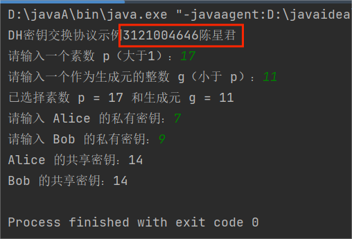

# 一、设计要求
### 编程实现DH密钥协商协议
提示：
- 编写函数 bool isPrime(int n) ， 判断 n是素数。
- 编写函数 int GCD(int a, int b)，计算 a，b最大公因子。
- 编写函数 int ExpMod(int b, int n, int m) ，计算 b^n mod m。
- 编写函数 bool isPrimeRoot(g, p)，判断 g是模p乘的生成元。
- 寻找p的生成元 ，从 g 从2，3等较小的数开始进行穷举。
- 计算 g^n mod p ， 1<=n < p-1 的到的数据不同，g即为生成元。
- 可以在网上搜集相应的算法即源代码，但不能使用语言提供的函数直接的出结果。

# 二、开发环境
编程环境：IntelliJ IDEA Community Edition 2023.1.2
操作系统：Win10

# 三、实验原理
- 选择公开参数：
选择一个素数 p 和一个生成元 g。p是一个大素数，而g是模p的原根。这些参数会被通信双方公开。

- 私有密钥生成：
每个通信方（假设为 Alice 和 Bob）选择自己的私有密钥。
Alice 选择私有密钥 a，Bob 选择私有密钥 b。

- 计算公共密钥：
Alice 计算公共密钥 A = g^a mod p，将其发送给 Bob。
Bob 计算公共密钥 B = g^b mod p，将其发送给 Alice。

- 计算共享密钥：
Alice 使用 Bob 发送的公共密钥 B 和自己的私有密钥 a 计算共享密钥 K = B^a mod p。
Bob 使用 Alice 发送的公共密钥 A 和自己的私有密钥 b 计算相同的共享密钥 K = A^b mod p。

- 共享密钥建立：
现在，Alice 和 Bob 都计算出了相同的共享密钥 K，该密钥可用于对称加密算法（如AES）来加密通信内容。

# 四、项目开发
JAVA
```java
import java.util.ArrayList;
import java.util.Scanner;

public class DHKeyExchange {
    // 判断是否为素数
    public static boolean isPrime(int n) {
        if (n <= 1) return false;
        if (n <= 3) return true;
        if (n % 2 == 0 || n % 3 == 0) return false;

        for (int i = 5; i * i <= n; i = i + 6) {
            if (n % i == 0 || n % (i + 2) == 0)
                return false;
        }
        return true;
    }

    // 计算最大公因子
    public static int GCD(int a, int b) {
        if (b == 0) return a;
        return GCD(b, a % b);
    }

    // 计算 b^n mod m
    public static int ExpMod(int b, int n, int m) {
        if (n == 0) return 1;

        long t = ExpMod(b, n / 2, m);
        long result = (t * t) % m;
        if (n % 2 == 1)
            result = (result * b) % m;

        return (int) result;
    }

    // 判断是否为模 p 的生成元
    public static boolean isPrimeRoot(int g, int p) {
        ArrayList<Integer> powers = new ArrayList<>();
        int phi = p - 1;

        for (int i = 1; i <= phi; i++) {
            powers.add(ExpMod(g, i, p));
        }

        powers.sort(Integer::compareTo);

        for (int i = 1; i <= phi; i++) {
            if (powers.get(i - 1) == powers.get(i % phi)) {
                return false;
            }
        }

        return true;
    }

    public static void main(String[] args) {
        Scanner scanner = new Scanner(System.in);

        System.out.println("DH密钥交换协议示例3121004646陈星君");
        System.out.print("请输入一个素数 p（大于1）：");
        int p = scanner.nextInt();

        if (p <= 1 || !isPrime(p)) {
            System.out.println("输入不合法，请输入一个大于1的素数。");
            return;
        }

        System.out.print("请输入一个作为生成元的整数 g（小于 p）：");
        int g = scanner.nextInt();

        if (g >= p || g <= 1 || !isPrimeRoot(g, p)) {
            System.out.println("输入不合法，请输入小于 p 且符合要求的生成元。");
            return;
        }

        System.out.println("已选择素数 p = " + p + " 和生成元 g = " + g);

        System.out.print("请输入 Alice 的私有密钥：");
        int aPrivate = scanner.nextInt();

        System.out.print("请输入 Bob 的私有密钥：");
        int bPrivate = scanner.nextInt();

        // 计算 Alice 和 Bob 的公共密钥
        int aPublic = ExpMod(g, aPrivate, p);
        int bPublic = ExpMod(g, bPrivate, p);

        // 计算共享密钥
        int sharedKeyAlice = ExpMod(bPublic, aPrivate, p);
        int sharedKeyBob = ExpMod(aPublic, bPrivate, p);

        // 打印共享密钥
        System.out.println("Alice 的共享密钥：" + sharedKeyAlice);
        System.out.println("Bob 的共享密钥：" + sharedKeyBob);

        // 关闭 Scanner
        scanner.close();
    }
}

```
# 五、结果测试

# 六、总结
- DH 协议的安全性依赖于离散对数问题，即对于给定的 p、g 和 A，计算出 a 的值难以实现。换句话说，找到 g^a mod p 的值（已知 g、a 和 p）难以在合理时间内计算出来。
- 公开的 p 和 g 不会被用于直接计算出密钥，而是用于生成公共密钥，而私有的 a 和 b 则是用于生成共享密钥。
- DH 密钥交换协议允许双方在不安全的通信信道上协商出一个共享密钥，这个密钥可以用于后续的加密通信，而不会直接暴露于外界，从而提供了一定程度的安全性。