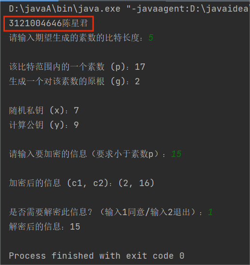

# 一、设计要求
### 编程实现ElGamal算法，根据不同素数生成不同公钥，包含加密和解密操作。

# 二、开发环境
编程环境：IntelliJ IDEA Community Edition 2023.1.2
操作系统：Win10

# 三、实验原理
- 选择素数p和底数g：选择一个大素数p和一个小于p的底数g。g被称为生成元，它的幂对于模p的值都不同。

- 生成私钥：选择一个私钥x，它是小于p-1的随机整数。

- 计算公钥：根据公式计算公钥y。g是基数，x是私钥，p是素数。

- 选择随机数k：选择一个随机数k，满足1≤k≤p−2，且k和p-1互质。

- 计算c1和c2

- 计算解密密文：使用自己的私钥x来解密。

# 四、项目开发
JAVA
```java
import java.math.BigInteger;
import java.security.SecureRandom;
import java.util.Scanner;

public class ElGamal {

    private BigInteger p; // 素数
    private BigInteger g; // 生成器
    private BigInteger x; // 私钥
    private BigInteger y; // 公钥

    public ElGamal(int bitLength) {
        // 生成素数 p
        SecureRandom random = new SecureRandom();
        p = BigInteger.probablePrime(bitLength, random);

        // 寻找模 p 的原根（生成器）
        g = findGenerator(p);

        // 生成私钥 x
        x = new BigInteger(bitLength, random).mod(p.subtract(BigInteger.ONE)).add(BigInteger.ONE);

        // 计算公钥 y
        y = g.modPow(x, p);
    }

    // 寻找模 p 的原根
    private BigInteger findGenerator(BigInteger prime) {
        BigInteger potentialGenerator = BigInteger.TWO;
        while (potentialGenerator.compareTo(prime.subtract(BigInteger.ONE)) < 0) {
            if (potentialGenerator.modPow(prime.subtract(BigInteger.ONE), prime).equals(BigInteger.ONE)) {
                return potentialGenerator;
            }
            potentialGenerator = potentialGenerator.add(BigInteger.ONE);
        }
        return BigInteger.ONE;
    }

    // 使用 ElGamal 加密信息
    public BigInteger[] encrypt(BigInteger message) {
        SecureRandom random = new SecureRandom();
        BigInteger k = new BigInteger(p.bitLength() - 1, random).mod(p.subtract(BigInteger.ONE)).add(BigInteger.ONE);
        BigInteger a = g.modPow(k, p);
        BigInteger b = y.modPow(k, p).multiply(message).mod(p);
        return new BigInteger[]{a, b};
    }

    // 解密 ElGamal 密文
    public BigInteger decrypt(BigInteger[] ciphertext) {
        BigInteger a = ciphertext[0];
        BigInteger b = ciphertext[1];
        BigInteger axInverse = a.modPow(x, p).modInverse(p);
        return b.multiply(axInverse).mod(p);
    }

    public static void main(String[] args) {
        Scanner scanner = new Scanner(System.in);
        System.out.print("3121004646陈星君\n请输入期望生成的素数的比特长度：");
        int bitLength = scanner.nextInt();

        ElGamal elGamal = new ElGamal(bitLength);

        System.out.println("\n该比特范围内的一个素数 (p)：" + elGamal.p);
        System.out.println("生成一个对该素数的原根 (g)：" + elGamal.g);
        System.out.println("\n随机私钥 (x)：" + elGamal.x);
        System.out.println("计算公钥 (y)：" + elGamal.y);


        System.out.print("\n请输入要加密的信息（要求小于素数p）：");
        BigInteger message = scanner.nextBigInteger();

        BigInteger[] ciphertext = elGamal.encrypt(message);
        System.out.println("\n加密后的信息 (c1, c2)：(" + ciphertext[0] + ", " + ciphertext[1] + ")");

        System.out.print("\n是否需要解密此信息？（输入1同意/输入2退出）：");
        scanner.nextLine(); // 消耗换行符
        String choice = scanner.nextLine().toLowerCase();
        if (choice.equals("1")) {
            BigInteger decryptedMessage = elGamal.decrypt(ciphertext);
            System.out.println("解密后的信息：" + decryptedMessage);
        } else {
            System.out.println("再见！");
        }
    }
}

```
# 五、结果测试

# 六、总结
ElGamal算法基于离散对数问题的困难性，即在模素数p下求解反函数（已知g和p求解x）是困难的。这使得通过已知公钥和密文来推导出消息或私钥变得非常困难，除非能够解决离散对数问题。

虽然ElGamal算法安全可靠，但需要注意在实现时选择合适的素数p和其他参数，以及保证密钥的安全性和随机性。