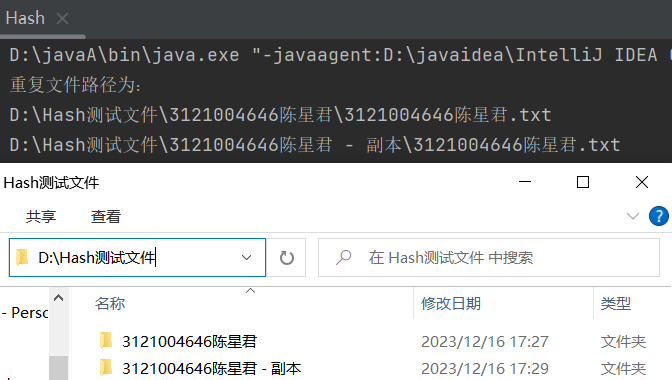

# 一、设计要求
### 利用软件提供的Hash函数实现查找本地硬件重复文件
1. 首先计算硬盘文件的Hash，并记录文件路径与Hash值的对应关系。
2. 利用具有相同Hash值的文件，内容就极其可能相同的特性，查找具有相同Hash值的文件。
3. 可以简单比较一下具有相同Hash值的文件是否长度，部分随机内容相同，如果相同则直接输出，否则说明发生了碰撞。
4. 注意保护个人隐私。

# 二、开发环境
编程环境：IntelliJ IDEA Community Edition 2023.1.2
操作系统：Win10

# 三、实验原理
- 哈希函数生成哈希值： 哈希函数接收文件作为输入并生成一个固定长度的哈希值。哈希函数的特性是，相同的输入始终生成相同的哈希值，即使文件内容只有微小的变化，哈希值也会完全不同。常见的哈希函数有MD5、SHA-1、SHA-256等。

- 比较哈希值： 系统遍历硬盘上的文件，并为每个文件生成哈希值。生成哈希值后，系统将这些哈希值进行比较，如果有相同的哈希值，系统就会认为这两个文件很可能是相同的或者有很大概率是相同的。

- 确认重复文件： 一旦发现相同的哈希值，系统并不是直接确认这两个文件内容完全相同，而是会进行进一步的检查。因为哈希冲突是可能的，即不同的文件可能具有相同的哈希值。所以，在哈希值匹配后，系统通常会进行额外的比较，比如对文件内容进行逐字节的比较来确认是否真正相同。

- 标记或删除重复文件： 如果确认两个文件是相同的，系统可以根据需求进行操作，比如标记其中一个文件，删除多余的副本，或者进行其他用户定义的操作。
# 四、项目开发
JAVA
```java
import java.io.File;
import java.io.FileInputStream;
import java.io.FileNotFoundException;
import java.io.InputStream;
import java.math.BigInteger;
import java.security.MessageDigest;
import java.util.ArrayList;


public class Hash {

    public static void main(String[] args) {
        ArrayList<File> filepath = new ArrayList<>();
        ArrayList<String> MD5value = new ArrayList<>();
        File fl  = new File("D:\\Hash测试文件");
        File[] file = fl.listFiles();
        open(file,filepath,MD5value);
        checkRepeat(filepath,MD5value);
    }

    public static void checkRepeat( ArrayList<File> filepath, ArrayList<String> MD5value){
        for (int i = 0; i < MD5value.size(); i++) {
            String str = MD5value.get(i);
            for (int j = i+1; j < MD5value.size(); j++) {
                if (str.equals(MD5value.get(j))){
                    System.out.println("重复文件路径为：");
                    System.out.println(filepath.get(i));
                    System.out.println(filepath.get(j));
                    System.out.println();
                }
            }
        }
    }

    public static void fileTraverse(File files, ArrayList<File> filepath, ArrayList<String> MD5value) {
        // 创建文件数组
        File[] arrFile = files.listFiles();
        ArrayList<File> filepaths = filepath;
        ArrayList<String> MD5values = MD5value;
        // 遍历文件数组（增强for循环）
        for (File file : arrFile) {
            // 进行判断，判断遍历出的文件是否为文件目录
            if (file.isDirectory()) {
                // 打印出文件的绝对路径
                filepath.add(new File(file.getAbsolutePath()));
                try {
                    MD5value.add(md5HashCode(file.getAbsolutePath()));
                } catch (FileNotFoundException e) {
                    e.printStackTrace();
                }
                //System.out.println("这是目录：" + file.getAbsolutePath());
                // 调用文件遍历的方法，再次遍历此文件目录下的文件
                fileTraverse(file ,filepaths, MD5values);
            } else {
                // 打印所有文件
                //System.out.println("这是文件：" + file.getAbsolutePath());
                // 调用文件读取的方法
                //fileRead(file);
            }

        }
    }

    public static void open(File[] fl2, ArrayList<File> filepath, ArrayList<String> MD5value) {
        ArrayList<File> filepaths = filepath;
        ArrayList<String> MD5values = MD5value;
        try {
            //利用for循环，再依次判断文件类型，为一般文件则打印出来，为目录则重复调用。
            for (int i = 0; i < fl2.length; i++) {
                if (fl2[i].isFile()) {

                    filepaths.add(fl2[i]);
                    MD5values.add(md5HashCode(String.valueOf(fl2[i])));
                }else {
                    File[] fl3 = fl2[i].listFiles();
                    open(fl3,filepaths,MD5values);
                }
            }
        } catch (Exception e) {

        }
    }

    public static String md5HashCode(String filePath) throws FileNotFoundException{
        FileInputStream fis = new FileInputStream(filePath);
        return md5HashCode(fis);
    }

    public static String md5HashCode(InputStream fis) {
        try {
            //拿到一个MD5转换器,如果想使用SHA-1或SHA-256，则传入SHA-1,SHA-256
            MessageDigest md = MessageDigest.getInstance("MD5");

            //分多次将一个文件读入，对于大型文件而言，比较推荐这种方式，占用内存比较少。
            byte[] buffer = new byte[1024];
            int length = -1;
            while ((length = fis.read(buffer, 0, 1024)) != -1) {
                md.update(buffer, 0, length);
            }
            fis.close();
            //转换并返回包含16个元素字节数组,返回数值范围为-128到127
            byte[] md5Bytes  = md.digest();
            BigInteger bigInt = new BigInteger(1, md5Bytes);//1代表绝对值
            return bigInt.toString(16);//转换为16进制
        } catch (Exception e) {
            e.printStackTrace();
            return "";
        }
    }
}
```
# 五、结果测试

# 六、总结
- 高效性： 哈希查找重复文件是一种高效的方法，因为哈希值唯一地标识了文件，可以快速识别相同的文件。

- 冲突处理： 要注意哈希冲突的可能性，即不同的文件生成相同的哈希值。因此，在发现相同哈希值的文件后，需要进行额外的验证，确认它们是否确实相同。

- 数据完整性： 选择合适的哈希算法对于保持数据完整性至关重要。一些哈希算法可能存在安全性问题或者被证明容易产生碰撞，因此需要谨慎选择。

- 操作谨慎： 在标记或删除文件之前，确保了解文件的用途和重要性，避免意外删除重要数据。