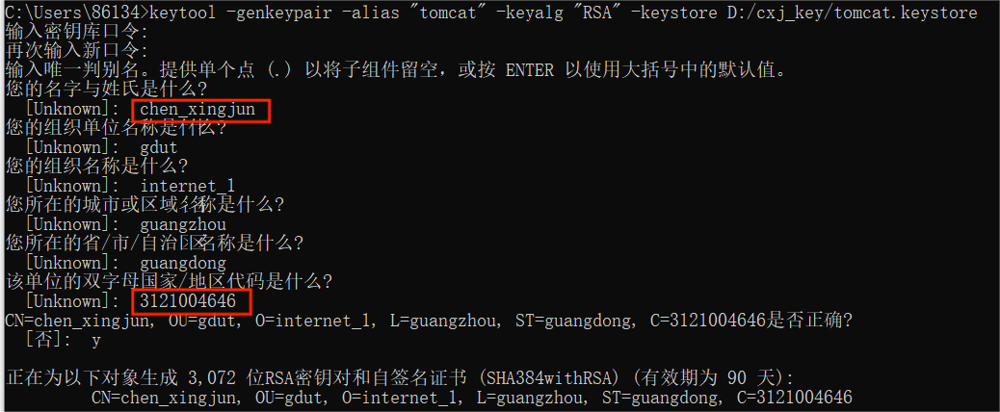

# 实验一 PKI相关操作
## 一、实验要求
在个人熟悉的平台上搜索下载安装PKI平台软件。练习证书的申请，创建，分发等操作。
## 二、开发环境
编程环境：JDK Version 20.0.1
操作系统：Win10
## 三、实验设计
### 1、创建密钥库

### 2、查看密钥库信息

### 3、导出密钥库条目证书

### 4、生成签发证书所需另一密钥库

### 5、签发证书

### 6、更多基本操作

四、总结
通过该实验我初步了解和熟悉了关于创建、签发证书的基本操作，对往后的SSL有关实验打下基础。