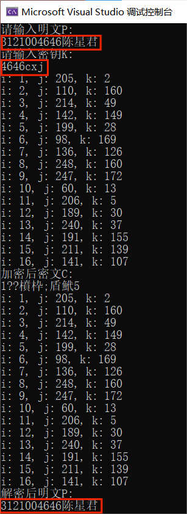

# 一、设计要求
1. 编写RC4算法进行加密和解密，可以选择密钥。  
2. 显示I,J,K的变化

# 二、开发环境
编程环境：Visual Studio 2022
操作系统：Win10

# 三、实验原理
- 密钥调度算法（Key Scheduling Algorithm，KSA）：
使用长度为 256 的数组 S（初始化为 0 到 255）和用户提供的密钥进行初始化。
密钥调度算法会通过对数组 S 的重排列来生成初始的 S 盒状态。
这一过程包括将密钥字节的序列和 S 盒进行混合和交换，以创建一个初始化后的混乱状态，用于生成伪随机流。

- 伪随机生成算法（Pseudo-Random Generation Algorithm，PRGA）：
初始化完成后，通过 PRGA 生成伪随机密钥流。
PRGA 使用初始化后的 S 盒状态进行运算，不断交换 S 盒中的元素并生成密钥流。
每次生成一个字节的伪随机密钥，并用于对明文进行加密或解密。

- 加密和解密过程：
加密和解密过程都是通过将明文与生成的伪随机密钥流进行按位异或运算来实现。
对明文逐字节执行异或运算，将生成的伪随机密钥流作为密钥，以此来加密或解密数据。
# 四、项目开发
C++
```cpp
#include <iostream>
#include <string>
using namespace std;

class RC4 {
private:
    unsigned char s[256];

    void swap(unsigned char& a, unsigned char& b) {
        unsigned char tmp = a;
        a = b;
        b = tmp;
    }

    void init_sbox(string key) {
        for (unsigned int i = 0; i < 256; i++)
            s[i] = i;
        unsigned char T[256] = { 0 };
        unsigned keylen = key.length();
        for (int i = 0; i < 256; i++)
            T[i] = key[i % keylen];
        for (int j = 0, i = 0; i < 256; i++) {
            j = (j + s[i] + T[i]) % 256;
            swap(s[i], s[j]);
        }
    }

public:
    void enc_dec(string& data, string key) {
        init_sbox(key);
        unsigned int datalen = data.length();
        unsigned char k, i = 0, j = 0, t;
        for (unsigned int h = 0; h < datalen; h++) {
            i = (i + 1) % 256;
            j = (j + s[i]) % 256;
            swap(s[i], s[j]);
            t = (s[i] + s[j]) % 256;
            k = s[t];
            data[h] ^= k;

            // 显示 i、j、k 的值
            cout << "i: " << static_cast<int>(i) << ", j: " << static_cast<int>(j) << ", k: " << static_cast<int>(k) << endl;
        }
    }
};

int main() {
    RC4 rc4;
    string data, key;
    cout << "请输入明文P:" << endl;
    cin >> data;
    cout << "请输入密钥K:" << endl;
    cin >> key;
    rc4.enc_dec(data, key);
    cout << "加密后密文C:\n" << data << endl;
    rc4.enc_dec(data, key);
    cout << "解密后明文P:\n" << data << endl;
    return 0;
}

```
# 五、结果测试

# 六、总结
RC4 是一种速度较快的加密算法，特别适用于对流式数据进行加密和解密。算法本身相对简单，易于实现和理解。支持变长密钥，允许使用不同长度的密钥对数据进行加密。尽管 RC4 算法在性能上有一定优势，但它也存在一些安全性问题，包括密钥流的偏置问题和一些已知的攻击方法。因此，现代加密标准和协议不再推荐使用 RC4 算法作为加密手段，而是更倾向于使用更安全和更健壮的加密算法，如 AES。