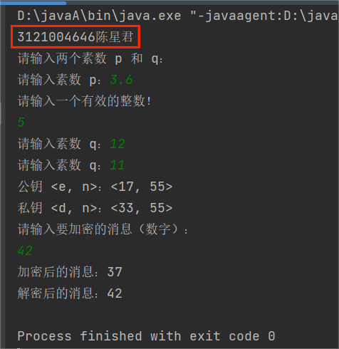

# 一、设计要求
### 编程实现RSA算法
- 用户输入两个素数pq，随机生成并显示e，得到公钥<e,n>，再计算得到密钥<d,n>
- 打印显示后，用户输入明文，然后进行加密和解密操作
- 注意边界性检查，例如判断素数，用户输入数是否为整数等

# 二、开发环境
编程环境：IntelliJ IDEA Community Edition 2023.1.2
操作系统：Win10

# 三、实验原理
### 密钥生成
- 选择两个大素数 p 和 q，它们的乘积 n 构成了RSA的大整数模数：n = p * q。

- 计算 n 的欧拉函数 φ(n)：φ(n) = (p-1) * (q-1)。

- 选择一个满足特定条件的指数 e，它需要满足 1 < e < φ(n) 且 e 和 φ(n) 互质（没有除了1以外的公约数）。
- 计算私钥指数 d，使得 (e * d) mod φ(n) = 1。私钥是 (d, n)。

### 加密
- 明文消息转换为整数 m，确保 0 ≤ m < n。
- 使用公钥 (e, n) 对消息进行加密，得到密文 c。

### 解密
- 使用私钥 (d, n) 对密文 c 进行解密，得到原始的明文消息 m。

# 四、项目开发
JAVA
```java
import java.util.Scanner;
import java.math.BigInteger;
import java.security.SecureRandom;

public class RSA {

    public static void main(String[] args) {
        Scanner scanner = new Scanner(System.in);

        // 输入两个素数 p 和 q
        System.out.println("3121004646陈星君\n请输入两个素数 p 和 q：");
        BigInteger p = getPrimeFromUser(scanner, "p");
        BigInteger q = getPrimeFromUser(scanner, "q");

        // 计算 n 和 φ(n)
        BigInteger n = p.multiply(q);
        BigInteger phi = p.subtract(BigInteger.ONE).multiply(q.subtract(BigInteger.ONE));

        // 随机生成 e
        BigInteger e = generateRandomE(phi);

        // 计算 d
        BigInteger d = e.modInverse(phi);

        // 显示公钥和私钥
        System.out.println("公钥 <e, n>：" + "<" + e + ", " + n + ">");
        System.out.println("私钥 <d, n>：" + "<" + d + ", " + n + ">");

        // 用户输入明文
        System.out.println("请输入要加密的消息（数字）：");
        BigInteger plaintext = scanner.nextBigInteger();

        // 加密
        BigInteger ciphertext = plaintext.modPow(e, n);
        System.out.println("加密后的消息：" + ciphertext);

        // 解密
        BigInteger decryptedText = ciphertext.modPow(d, n);
        System.out.println("解密后的消息：" + decryptedText);

        scanner.close();
    }

    // 从用户输入获取素数
    private static BigInteger getPrimeFromUser(Scanner scanner, String primeName) {
        BigInteger prime;
        do {
            System.out.print("请输入素数 " + primeName + "：");
            while (!scanner.hasNextBigInteger()) {
                System.out.println("请输入一个有效的整数！");
                scanner.next();
            }
            prime = scanner.nextBigInteger();
        } while (!isPrime(prime));

        return prime;
    }

    // 判断一个数是否为素数
    private static boolean isPrime(BigInteger num) {
        return num.isProbablePrime(100); // 使用概率素数测试
    }

    // 随机生成 e
    private static BigInteger generateRandomE(BigInteger phi) {
        BigInteger e;
        SecureRandom random = new SecureRandom();

        do {
            e = new BigInteger(phi.bitLength(), random);
        } while (e.compareTo(BigInteger.ONE) <= 0 || e.compareTo(phi) >= 0 || !e.gcd(phi).equals(BigInteger.ONE));

        return e;
    }
}

```
# 五、结果测试

# 六、总结
- RSA算法的安全性依赖于两个大素数相乘很容易，但给出乘积后将其因数分解却非常困难，即给定一个大合数 n，找到质因数 p 和 q 是困难的。
- 在已知公钥的情况下，计算出私钥也是困难的。

RSA算法因其安全性和实用性被广泛应用于加密通信、数字签名和安全认证等领域。