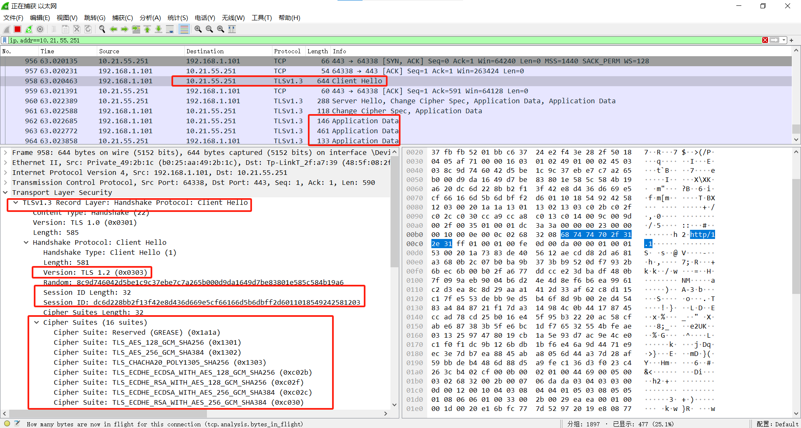

# 实验二 SSL协议分析
## 一、实验要求
进行SSL协议分析，对比有无SSL协议的情况下，用Wireshark抓包的不同效果。
## 二、开发环境
实验环境：Wireshark
操作系统：Win10
## 三、实验内容
### 1、没有SSL协议的情况

无SSL协议时个人信息暴露：

### 2、使用SSL协议的情况

SSL协议过程：

## 四、总结
抓取使用SSL协议加密的数据包比未加密的数据包更有优点。SSL协议加密了传输的数据，因此抓取这些数据包并不能直接查看其中的内容，这对于保护敏感信息（如登录凭据、个人数据等）很重要。用户隐私得到了更好的保护，因为未经授权的人无法轻易获取和阅读传输的内容。
